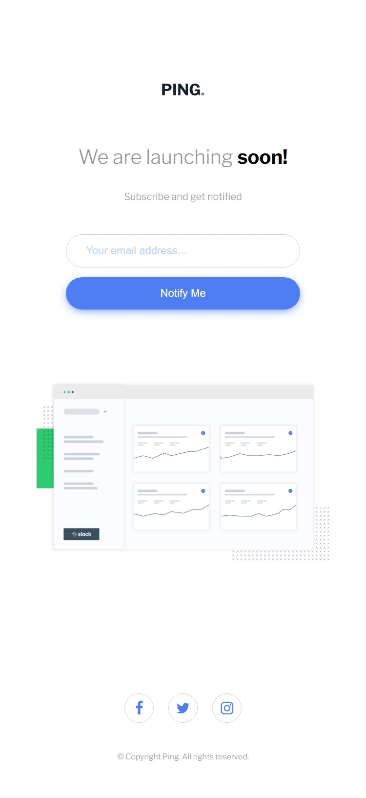
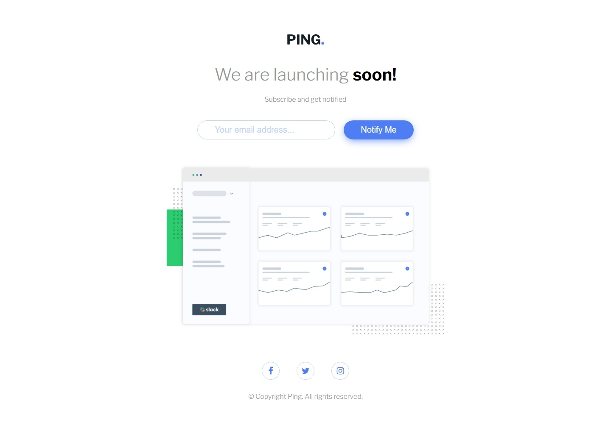

# Frontend Mentor - Ping coming soon page solution

This is a solution to the [Ping coming soon page challenge on Frontend Mentor](https://www.frontendmentor.io/challenges/ping-single-column-coming-soon-page-5cadd051fec04111f7b848da). Frontend Mentor challenges help you improve your coding skills by building realistic projects.

## Table of contents

- [Overview](#overview)
  - [The challenge](#the-challenge)
  - [Screenshot](#screenshot)
  - [Links](#links)
- [My process](#my-process)
  - [Built with](#built-with)
  - [What I learned](#what-i-learned)
  - [Continued development](#continued-development)
  - [Useful resources](#useful-resources)
- [Author](#author)
- [Acknowledgments](#acknowledgments)

## Overview

### The challenge

Users should be able to:

- View the optimal layout for the site depending on their device's screen size
- See hover states for all interactive elements on the page
- Submit their email address using an `input` field
- Receive an error message when the `form` is submitted if:
  - The `input` field is empty. The message for this error should say _"Whoops! It looks like you forgot to add your email"_
  - The email address is not formatted correctly (i.e. a correct email address should have this structure: `name@host.tld`). The message for this error should say _"Please provide a valid email address"_

### Screenshot




### Links

- Solution URL: [Solution on GitHub](https://github.com/horoserp/coming-soon-ping)
- Live Site URL: [Live Site](https://horoserp.github.io/coming-soon-ping)

## My process

### Built with

- Semantic HTML5 markup
- CSS custom properties
- Flexbox
- Mobile-first workflow

### What I learned

I worked a lot at optimizing my JavaScript for form validation, taking advantage of the invalid and blur events.

```js
email.addEventListener("invalid", postError);
email.addEventListener("blur", clearError);

function postError() {
  email.required = false;
  email.type = "text";
  email.setSelectionRange(email.value.length, email.value.length);
  email.classList.add("error");
  if (email.value === "") {
    errorMessage.innerHTML = "Required!";
  } else {
    errorMessage.innerHTML = "Please provide a valid email address";
  }
}
```

### Continued development

I would like to delve more into different events and see how I can utilize them in future code.

### Useful resources

- [W3Schools](https://www.w3schools.com/) - This is a great reference site which helped me remember some of the required syntax.
- [Stack Overflow](https://stackoverflow.com/) - This is an excellent resource for finding answers to precise questions.

## Author

- Website - [Robert P. Horosewski](https://horoserp.github.io/React-Portfolio)
- Frontend Mentor - [@horoserp](https://www.frontendmentor.io/profile/horoserp)
- LinkedIn - [Robert P. Horosewski](https://www.linkedin.com/in/robert-horosewski-8a0608196/)

## Acknowledgments

Thanks to my wife for the encouragement to pursue my dream. Thanks to my friends and family who've supported me. Thanks to the Frontend Mentor community, especially those who've helped me along this journey.
